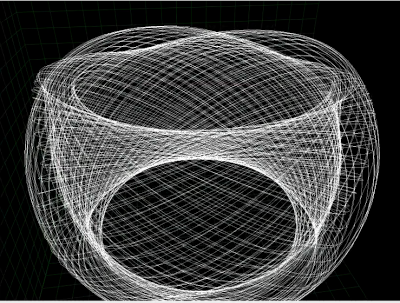

# korbie
Explore the possible (bounded) orbits around a spinning black hole.

### ready to run binaries
These packages are large (about 600 MB unpacked) in order to minimize dependencies on the target machine.
All needed libraries (like Qt) are included for the sole use of the application; no alterations are made
to existing libraries or any other part of the environment.

#### Ubuntu (this will probably work on other debian-based systems like MxLinux as well.)
Tested on ubuntu-20.04.1-desktop-amd64.

[korbie_ubuntu_release_1.0.tar.gz](https://drive.google.com/uc?export=download&id=1v4ExrdO_7y_YOk17_G2cbFRXM7e3TY5C) 

    $ tar xvf korbie_ubuntu_release_1.0.tar.gz
    $ ./korbie`
    
#### (more binaries coming soon.  See /src directory to build and run on all other OSes.)

